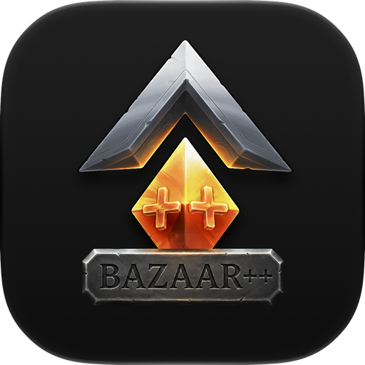

<div align="center">



# BazaarPlusPlus

**Born of Passion** · A BepInEx mod and desktop installer for [_The Bazaar_](https://www.playthebazaar.com)

[中文](README.md) · [Website](https://bazaarplusplus.com) · [Download](https://bazaarplusplus.com/download?lang=en) · [Tutorial](https://bazaarplusplus.com/tutorial?lang=en) · [Release Notes](https://github.com/BazaarPlusPlus/BazaarPlusPlus/releases) · [Ko-fi](https://ko-fi.com/cauyxy)

[](https://bazaarplusplus.com)
[](LICENSE)
[](https://bazaarplusplus.com/download)
[](https://github.com/BepInEx/BepInEx)
[](https://learn.microsoft.com/dotnet/standard/net-standard)
[](https://tauri.app)
[](https://react.dev)

</div>

---

BazaarPlusPlus is an open-source project for _The Bazaar_. The in-game BepInEx mod adds a card collection browser, run history, combat replays, tooltip previews, anonymous mode, Chinese terminology, and related quality-of-life features. The companion desktop installer handles download, install, repair, auto-update, and the stream overlay. This repository also holds the upload backend, the metrics analyzer, and the public website.

Most players should install from [bazaarplusplus.com/download](https://bazaarplusplus.com/download?lang=en); this repository is for developers who want to inspect the implementation, contribute changes, or build locally.

> [!NOTE]
> The bulk of the codebase is led by [Codex](https://openai.com/codex), with [Claude Code](https://claude.com/product/claude-code) contributing in collaboration.

## Quick Start

1. Open [bazaarplusplus.com/download](https://bazaarplusplus.com/download?lang=en) and choose the Windows `.exe` or macOS `.dmg`.
2. Close the game before running the installer. For updates, uninstall the old build before installing the new one.
3. Launch _The Bazaar_ once after installation so BazaarPlusPlus can finish setup.
4. On the main menu, confirm that the **Card Collection** button appears and the footer version text includes `BPP version`.

Feature guides, hotkeys, and installation details live at [bazaarplusplus.com/tutorial](https://bazaarplusplus.com/tutorial?lang=en).

## Feature Overview

### In-Game Mod

| Feature                           | Description                                                                                                                         |
| --------------------------------- | ----------------------------------------------------------------------------------------------------------------------------------- |
| **Card Collection**               | Browse items and skills in-game, with filters for hero, tier, size, merchant, and current run day.                                  |
| **BazaarDB Auto Upload**          | Community-data contribution that uploads end-of-run screenshots and board data in the background. Disabled by default; opt-in only. |
| **Run History and Combat Replay** | Press `F8` to browse past runs and key fights, and watch replays and ghost battles.                                                 |
| **Combat Status Bar**             | Shows combat time and pause state, with speed controls — handy for review, recording, and streaming.                                |
| **Anonymous Mode**                | Hide the local player name in screenshots, recordings, and streams.                                                                 |
| **Legendary Rank Display**        | Hide your rank, show an exaggerated power value, or display rank and rating together.                                               |
| **Enchant and Upgrade Previews**  | Preview post-enchant or post-upgrade item values directly in tooltips.                                                              |
| **Chinese Terminology Modes**     | Simplified Chinese plus Taiwan and Hong Kong Traditional terminology styles.                                                        |

### Desktop Installer

| Feature                                   | Description                                                                  |
| ----------------------------------------- | ---------------------------------------------------------------------------- |
| **Cross-platform install**                | Windows and macOS, with automatic Steam game-directory detection.            |
| **Repair / uninstall / reset local data** | Recover from broken installs, replay-data issues, or local-state corruption. |
| **Run history management**                | View, locate, and clean up locally saved run records and replay videos.      |
| **Stream Mode**                           | Start a localhost browser-source service for OBS and similar tools.          |
| **Auto-update**                           | Uses Tauri Updater to check for new releases and prompt when available.      |

## Repository Layout

| Directory                            | Contents                                             |
| ------------------------------------ | ---------------------------------------------------- |
| `bazaarplusplus-mod/`                | The BepInEx mod                                      |
| `bazaarplusplus-installer/`          | The desktop installer (Tauri 2 + React)              |
| `bazaarplusplus-server/`             | Cloudflare Worker: Bundle upload and Ghost discovery |
| `bazaarplusplus-analyzer/`           | Turns Bundles into hero and build snapshots          |
| `bazaarplusplus-site/`               | bazaarplusplus.com                                   |
| `VERSION`, `release.mjs`, `release/` | Product version and release pipeline                 |

Each project keeps its own toolchain, `README.md`, and `AGENTS.md`; the root [`AGENTS.md`](AGENTS.md) records cross-project conventions and contract owners.

## Building From Source

Install the toolchains listed in the [development guide](docs/development.md) (just, .NET, Node, Rust, Python/uv), then:

```bash
just setup                  # Shared local config, locked dependencies, Git hooks
just doctor                 # What is still missing on this machine
just mod::fetch macos online  # Game assemblies for the mod (Windows: windows)
just                        # Every command, grouped by project
```

The mod compiles against the game assemblies pinned by the Snapshot Lock `bazaarplusplus-mod/build/game-libs.lock.json`: `mod::fetch` accepts a local Steam install of _The Bazaar_ at the locked game version and otherwise pulls the snapshot from private storage; details are in the [development guide](docs/development.md#游戏程序集) (Chinese). Gate one project with `just <project>::check` and `just <project>::test`; `just fmt` formats every project. `just mod::build` only compiles; deploy a development DLL into the game explicitly with `just mod::build --deploy`.

Release builds are compiled, signed, and uploaded by the `release.yml` GitHub Actions workflow on hosted runners; the signing, notarization, and R2 credentials exist only as GitHub secrets and in the maintainers' local configuration, never in the public repository. Game assembly snapshots, decompiled game output, `.env`, and `.dev.vars` are not in the tree either. The release flow is in the [product release guide](docs/release.md) (Chinese).

## Derivative Work Notice

> [!IMPORTANT]
> If you plan to build on top of this project or release derivative mods, make sure your work complies with _The Bazaar_ official [Mod Policy](https://www.playthebazaar.com/mod-policy).

## Acknowledgements

|                          |                                                                                                                                                                                                                                                              |
| ------------------------ | ------------------------------------------------------------------------------------------------------------------------------------------------------------------------------------------------------------------------------------------------------------ |
| **Inspiration**          | [BazaarHelper](https://github.com/Duangi/BazaarHelper) · [BazaarPlannerMod](https://github.com/oceanseth/BazaarPlannerMod)                                                                                                                                   |
| **Data reference**       | [bazaardb.gg](https://bazaardb.gg)                                                                                                                                                                                                                           |
| **Runtime dependencies** | [BepInEx](https://github.com/BepInEx/BepInEx) · [Harmony](https://github.com/pardeike/Harmony) · [Tauri](https://tauri.app) · [React](https://react.dev) · [Vite](https://vite.dev) · [Tailwind CSS](https://tailwindcss.com) · [FFmpeg](https://ffmpeg.org) |
| **Co-creators**          | [Codex](https://openai.com/codex) · [Claude Code](https://claude.com/product/claude-code)                                                                                                                                                                    |

## Supporters

Thanks to everyone who supports BazaarPlusPlus. The full supporter list lives at [bazaarplusplus.com/support](https://bazaarplusplus.com/support?lang=en).

If you would like to support continued maintenance, head to [Ko-fi](https://ko-fi.com/cauyxy) or check the in-app sponsor options.

## License

Released under the [MIT License](LICENSE).

---

<div align="center">


**BazaarPlusPlus** · Born of Passion

[Website](https://bazaarplusplus.com) · [Download](https://bazaarplusplus.com/download?lang=en) · [Tutorial](https://bazaarplusplus.com/tutorial?lang=en) · [Ko-fi](https://ko-fi.com/cauyxy)

<sub>Archived history: [mod](https://github.com/BazaarPlusPlus/bazaarplusplus-mod) · [installer](https://github.com/BazaarPlusPlus/bazaarplusplus-installer) · [server](https://github.com/BazaarPlusPlus/bazaarplusplus-server) · [analyzer](https://github.com/BazaarPlusPlus/bazaarplusplus-analyzer) · [site](https://github.com/BazaarPlusPlus/bazaarplusplus-site)</sub>

</div>
